## Writeup Template

### You use this file as a template for your writeup.

---

**Lane Finding Project**

The goals / steps of this project are the following:

* Compute the camera calibration matrix and distortion coefficients given a set of chessboard images.
* Apply a distortion correction to raw images.
* Use color transforms, gradients, etc., to create a thresholded binary image.
* Apply a perspective transform to rectify binary image ("birds-eye view").
* Detect lane pixels and fit to find the lane boundary.
* Determine the curvature of the lane and vehicle position with respect to center.
* Warp the detected lane boundaries back onto the original image.
* Output visual display of the lane boundaries and numerical estimation of lane curvature and vehicle position.

[//]: # (Image References)

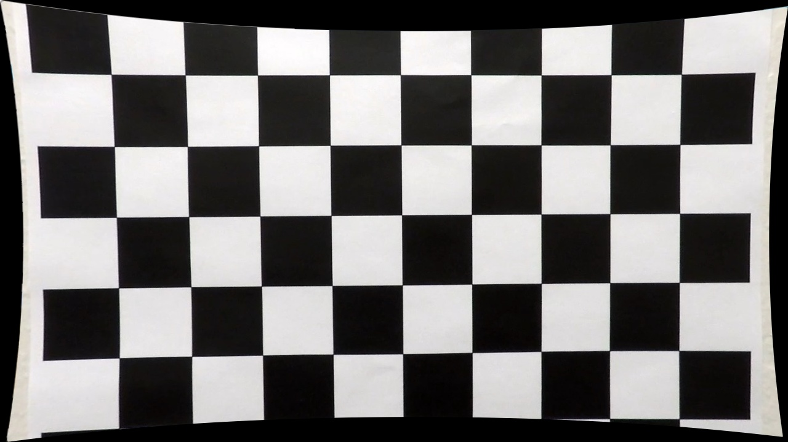
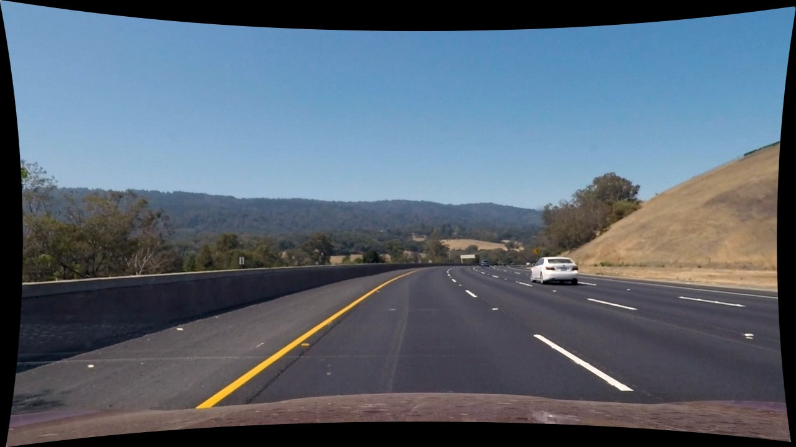
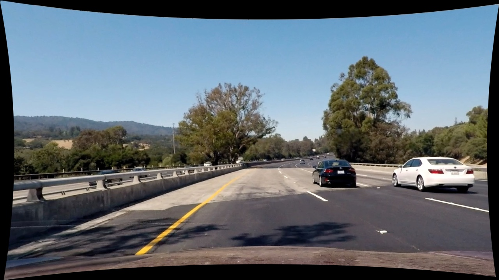
---

### Writeup / README

#### 1. Provide a Writeup that includes all the rubric points and how you addressed each one.

You're reading it!

### Camera Calibration

#### 1. Briefly state how you computed the camera matrix and distortion coefficients. Provide an example of a distortion corrected calibration image.

Algorithm for camera calibration is implemented in file on the path 'Zadatak/soilution/cameraCalibration.py'
This procedure is done in order to cancel out curvature of space caught by camera, this effect is also known as fish eye effect.
First part of this porcedure is calculation of calibration coefficients. For purposes of calculation of theese coefficitens a set of chess board images is used. Images are captured wiht camera, which needs to be calibrated to acquire coeefficients needed to avoid distortion of space caused by camera lenses.
Further image processing needs images that are as close as possible to the real world.
Function that executes camera calibration is calculateCameraCoeffs(rows, cols, imgPath), where rows and colons are chess board rows and colons, those parameters are determined by analysing input chessboard images.
Next step is to prepare object points for all images, which are x, y  and z coordinates for detected objects, z is always 0 because there is not 3rd coordinate on images.
Next step is to search for chess board corners in all images on specified path. When chess board corners are detected, those coordnates are stored for later use.
After finding all chessboard corners, coefficients for camera callibration are calculated with calibrateCamera function form opencv.
Chessboard examples for distortion:

### Pipeline (single images)

#### 1. Provide an example of a distortion-corrected image.

All distortion corrected chess board images are in /test_images_undistorted directory. Some of examples of distorted and corrected images are:

#### 2. Describe how (and identify where in your code) you used color transforms, gradients or other methods to create a thresholded binary image.  Provide an example of a binary image result.

Process of getting binary transformed image is implemented inside imageProcessing() function. Multiple steps are included in that process to retain only relevant data inside image.

1st step is hsv color filtering implemented inside hsvSpace.py file. In this step only yellow and white colors are retained in image, because lanes are marked either with yellow or white stripe. This section of code shows how masks are made, and which limits for H, S and V are used
    #mask for white
    lower = np.array([0, 0, 200])
    upper = np.array([255, 30, 255])
    maskW = cv2.inRange(hsv, lower, upper)

    #mask for yellow color
    lower = np.array([10, 100, 100])
    upper = np.array([30, 255, 255])
    maskY = cv2.inRange(hsv, lower, upper)
Example of color filtered image is 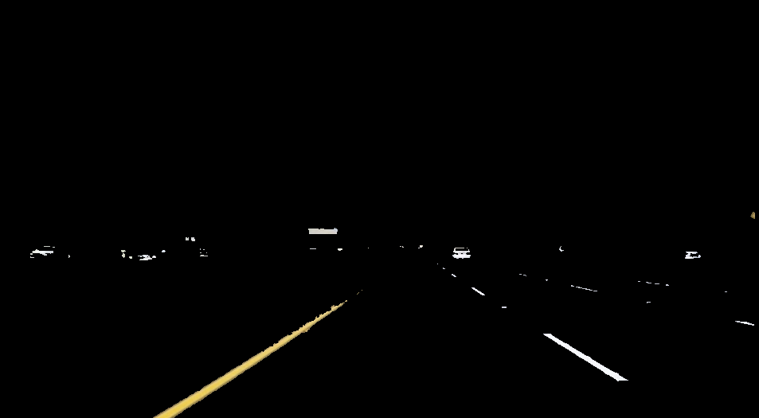.

2nd step is to convert color filtered image in gray scale. Example: 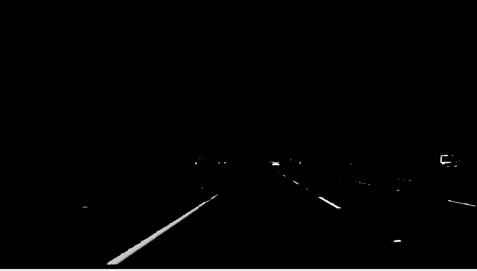

3rd step is to use Gaussian filter to reduce irrelevant data even more.

4th step is to detect edges. For this purpose Canny filter is used. Example: 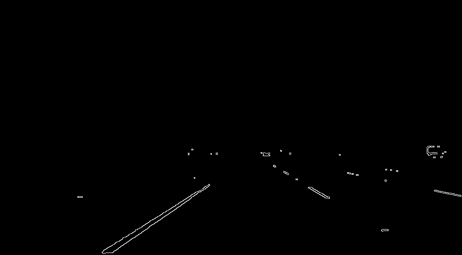

5th step is conversion of images with detected edges to binary image.

After this procedure only almost only relevant information is left inside image. The rest of irrelevant information is filtered after defining of region of interest (roi).

#### 3. Describe how (and identify where in your code) you performed a perspective transform and provide an example of a transformed image.

Definition of roi and perspective transformation are done inside of findROI() function in roi.py file. Src and dst points are determined by analysing all images and videos to find apropriate roi. There are two sets of roi limits based on resolution or image/video, both are separately made for 1280x720 and 960x540. This section of code shows how limits are set:

    if width == 1280 and height == 720:
        # print('hd image')
        src = np.float32([[540, 450], [200, height],  [1150,  height], [720, 450]])
        dst = np.float32([[width/4 , 0], [width/4 , height], [width/4*3, height],  [width/4*3 , 0]])
    elif width == 960 and height == 540:
        # print('less than hd image')
        src = np.float32([[430, 350], [200, height],  [890, height], [590, 350]])
        dst = np.float32([[width/4 , 0], [width/4 , height], [width/4*3, height],  [width/4*3 , 0]])

Function findROI() uses input image to find region of interest for lane tracking. Examples bellow are made with binary images with edges detected.

Input image: 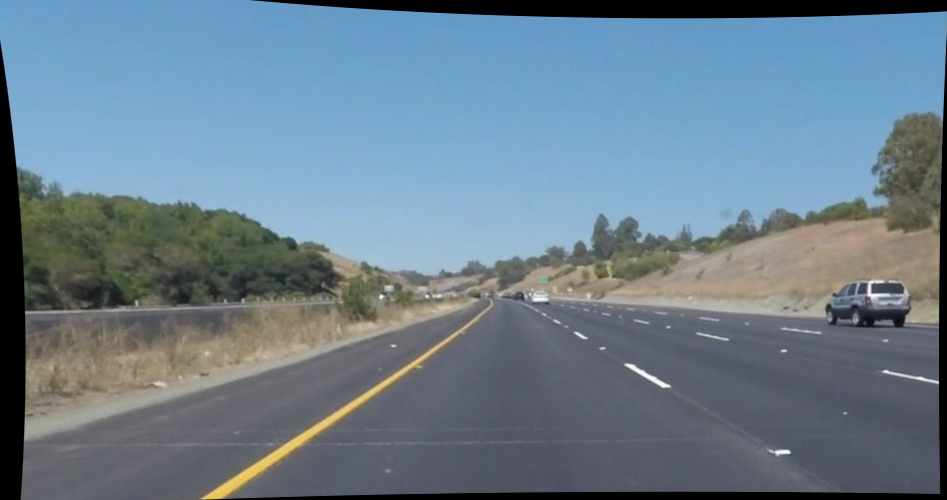
Warped image: 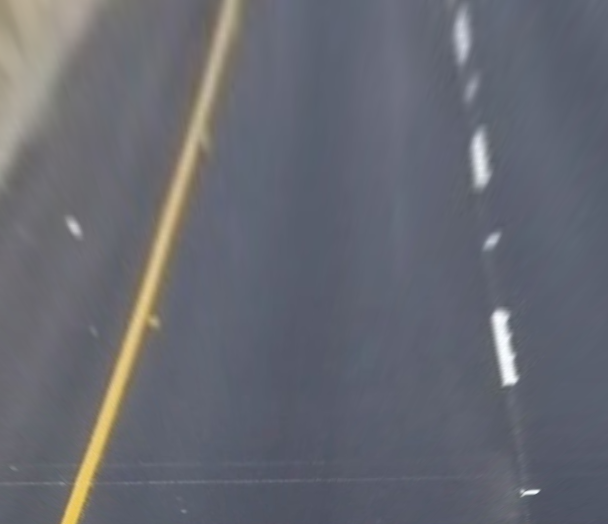
ROI: 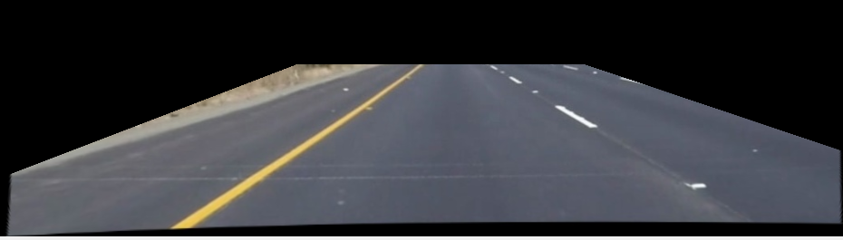

#### 4. Describe how (and identify where in your code) you identified lane-line pixels and fit their positions with a polynomial?

Lane tracikng and polynomial fitting algorithm is implemented inside imageHist.py file.
First step is to find histogram of image based on where are nonzero pixels in input image, which is binary perspective transformed image.
After finding histogram function slidingWindow() is called to set windows where most of the nonzero values in histogram are found.
First sliding window is put at the position of image determined as maximum values on two peaks of histogram which represent left and right lane limits. Position of next window is calculated after placing first two windows on both left and right lane.

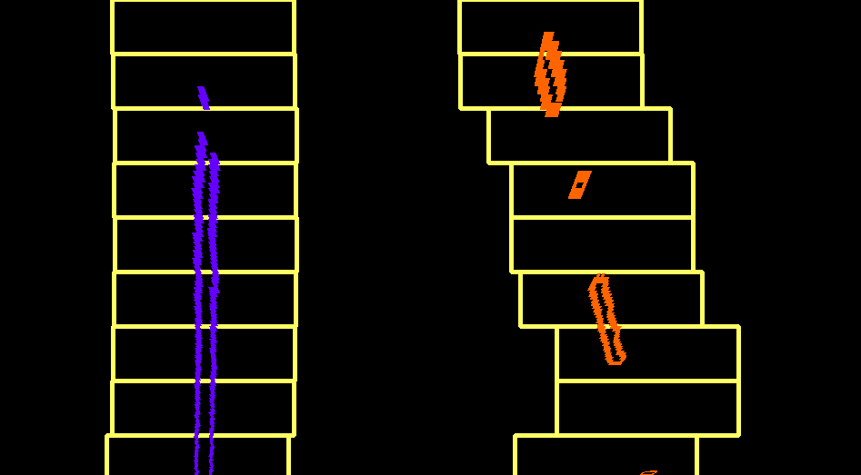

#### 5. Describe how (and identify where in your code) you calculated the radius of curvature of the lane and the position of the vehicle with respect to center.

Radius of curvature and vehicle offset form the center of the lane are calculated in get_curve() function inside imageHist.py file. Both are calculated after caclulating second derivative of fitted polynomial (second degree polynomial).

Center is calculated as arythmetical mean value between values of both left and right polynomials in same point.

#### 6. Provide an example image of your result plotted back down onto the road such that the lane area is identified clearly.

Marking of lanes is done inside markLines() function inside imageHist.py file.

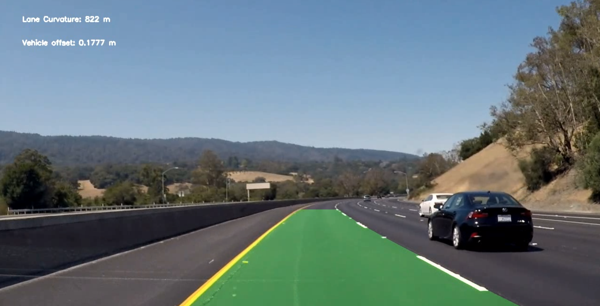

---

### Pipeline (video)

#### 1. Provide a link to your final video output.  Your pipeline should perform reasonably well on the entire project video (wobbly lines are ok but no catastrophic failures that would cause the car to drive off the road!).

Here's a <video src="documented_files/project_video03.mp4" controls title="Title"></video>

#### 1. Briefly discuss any problems / issues you faced in your implementation of this project.  Where will your pipeline likely fail?  What could you do to make it more robust?

First porblem i encountered was to make appropriate color filter, in order for algorithm to be more robust and immune to changes in road color or to sudden lighting changes. Next part of th problem was to make all algorithms inputs and outputs compatilbe to be able to pipeline them for video analysis.

In some cases when lane can not be detected properly, either because it is covered or lighting does not allow line to be distinguished from the rest of the road, algorithm does not work properly, and sometimes it makes faults in those cases.

There is a lot of room for upgrades and optimization of current setup of algorithm.
Better color filtering and adaptible ROI could help a lot in filterig out irrelevant data for further analysis.
